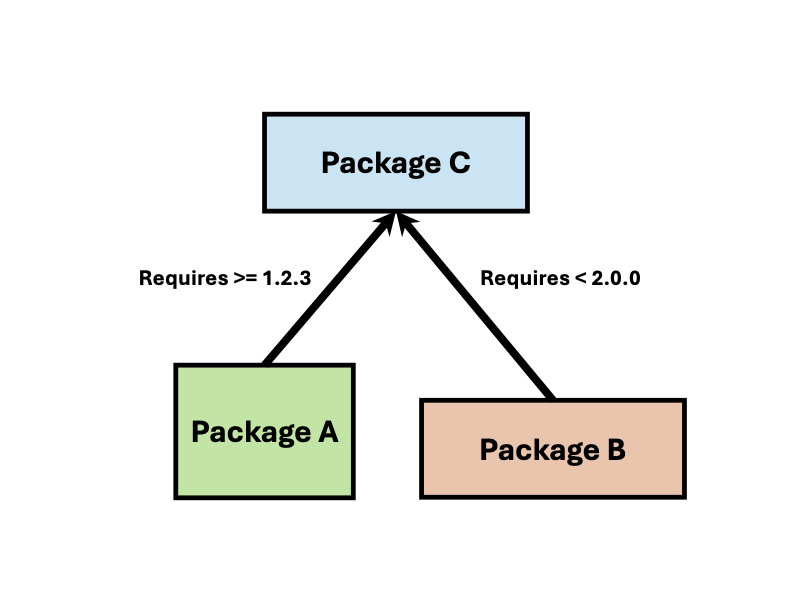
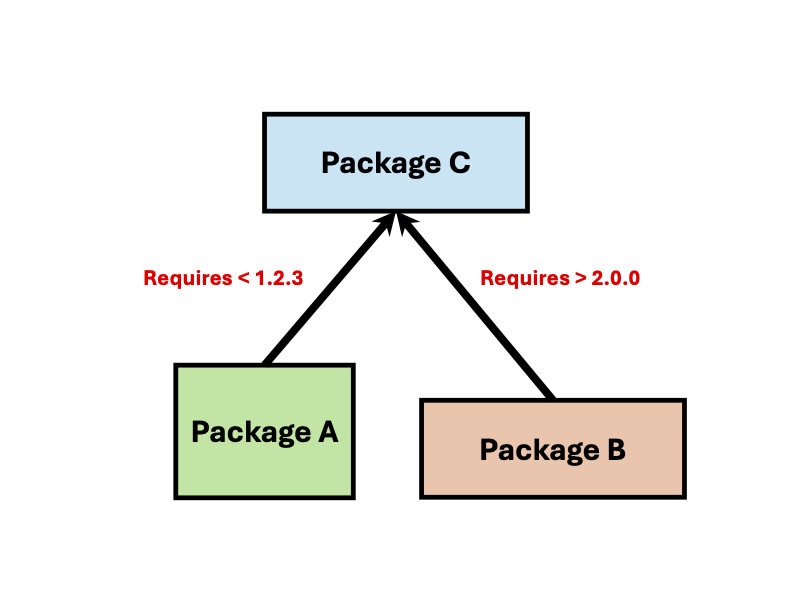
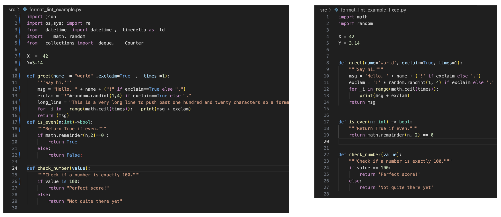

# Break

Take a 5 min break and stretch your legs

---

# Part II

- **Environment management**: make code reproducible
- **Formatting & linting**: make code clean and consistent
- **Testing**: ensure code works as intended
- **AI coding tools**: pair code with an AI agent

<!-- 
Caveat: I am very new to many of these tools, but I will try to share my personal perspective and the tricks I have found useful.
Feel free to ask questions at any point.
-->

---

# Environment management

- **Motivation:** Make code reproducible by identifying and solving dependencies

- **Examples:** **`pip venv`**, **`conda`**, [**`uv`**](https://docs.astral.sh/uv/)

<!--
We begin with environment management.
For Python code to run, you need to have the right version of Python and external libraries/packages/dependencies installed.
In other words, you need to have the right "environment".
Environment managers automate and simplify this process. 
Python has a built-in environment manager called "pip venv", but there are also popular third-party tools like "conda" and "uv".
My favorite is "uv" because it is the easiest to use, installs incredibly fast, and works well with other tools -- but we'll talk about that later.
-->

---

# Environment management

<!--
An environment manager will try to install all dependencies.Most packages depend on other packages, creating a dependency graph as shown. 
Suppose we need to install packages A and B, and both depend on package C.
Then the environment will need to install all three.
Luckily, A requires C version greater than 1.2.3, and B requires C version less than 2.0.0, so any version inbetween will do.
-->

---

# Environment management

<!--
But sometimes packages have conflicting requirements.
For example, if package A requires version < 1.2.3 of package C, and package B requires version > 2.0.0 of package C, then there is a conflict.
In such cases, you may need to manually resolve the conflict by adjusting versions or even using alternative packages.
-->

---

# Environment management with [**`uv`**](https://docs.astral.sh/uv/)

- **Basic commands**: 
**`uv init`**: create a new project
**`uv add <package>`**: add a dependency to the project
**`uv sync`**: install all dependencies
**`uv run <script.py>`**: run a script
**`uv help`**: display help information for uv commands

- Control all [**`uv`**](https://docs.astral.sh/uv/) settings and dependencies in **`pyproject.toml`**

<!--
Here are some basic uv commands ... 
To initialize uv in a new project, run "uv init".
To add a dependency, run "uv add" then the package name.
The command "uv sync" will rapidly install all dependencies, much faster than other environment managers.
To run a script, you would use "uv run" then the script name.
If you want to know what other commands are available, use the command "uv help".
-->

---

# Environment management with [**`uv`**](https://docs.astral.sh/uv/)

Let's practice using [**`uv`**](https://docs.astral.sh/uv/) and **`pyproject.toml`** to manage our environment.

---

# Formatting

- **Motivation:** Enforce consistent style (spacing, line lengths, etc.)

- **Examples:** **`isort`**, **`black`**, [**`ruff`**](https://docs.astral.sh/ruff/)

<!--
Good code is well-organized, stylistically consistent, and free of bugs and errors.
Formatters and linters are tools that help achieve these traits in your code.
Formatters improve the visual appearance of your code without changing functionality.
They enforce consistent style by controlling spacing, line lengths, indentation, etc.
Examples of formatters include isort, black, and ruff.
isort sorts imports alphabetically and automatically separates them into sections.
black reformats entire files, ensuring a consistent style throughout.
ruff is also a general formatter, that can basically do anything isort or black can do but faster, and its my preferred tool.
-->

---

# Linting

- **Motivation:** Identify and fix potential bugs and remove logically unnecesssary code

- **Examples:** **`pylint`**, **`flake8`**, [**`ruff`**](https://docs.astral.sh/ruff/)

<!--
Linters identify style violations, but also potential bugs and errors like unused variables, missing imports, or more subtle bugs beyond obvious syntactic errors.
There are a handful of popular and customizable linters, including flake8, pylint, and ruff.
You'll notice that we see ruff again here because it is both a formatter and a linter.
And yet again, my favorite tool here is "ruff" because it can do almost everything the other tools can but faster.
-->

---

# Formatting & linting with [**`ruff`**](https://docs.astral.sh/ruff/)

- **Format command:**
**`uv run ruff format file_to_be_formatted.py`**

- **Lint command:**
**`uv run ruff check --fix file_to_be_linted.py`**

- Or, simply use VSCode's **`ruff`** extension and format-on-save.

- Control all [**`ruff`**](https://docs.astral.sh/ruff/) settings (i.e. [rules](https://docs.astral.sh/ruff/rules/)) in **`pyproject.toml`**

<!--
To format with ruff, just "uv add ruff" as a dependency, then run "ruff format" on the file as shown.
To lint with ruff, just run "ruff check" on the file as shown.
Linting technically only identifies issues, it doesn't necessarilly fix them.
To have ruff fix any issues for which automatic fixes are available, add the --fix flag.

However, although these commands are relatively straightforward, they are not they way that I use ruff.
A big reason I love ruff is that there is a VSCode extension for it.
This allows ruff to provide real-time visual format & lint feedback.
Although we do no have the time to show you, I also recommend using format-on-save to automatically format and fix linting issues every time you ctrl+s save a file.

Finally, all ruff settings, like uv dependencies, are stored in pyproject.toml.
-->

---

# Formatting & linting with [**`ruff`**](https://docs.astral.sh/ruff/)

Let's practice using [**`ruff`**](https://docs.astral.sh/ruff/) and **`pyproject.toml`** to format and lint **`src/format_lint_example.py`**.

<!--
Lets look at an example:
1. Show format_lint_example.py
2. Point out formatting issues
3. Enable ruff extension -- 41 problems!
4. Hover over formatting issues
5. Run `uv run ruff format format_lint_example.py`
6. Use ctrl+z and ctrl+shift+z to undo and redo changes, highlighting specific changes from top to bottom
7. Go to pyproject.toml and highlight ruff format settings
8. Change line-length to 30 (way too short), and show how this immediately causes formatting issues in format_lint_example.py, then change back
9. Point out how there are still yellow squiggles in format_lint_example.py (18 problems); some of these are formatting issues ruff doesn't fix automatically (like "line too long"), but others are actually linting issues because they involve code syntax rather than format (e.g. truth comparison, unused variable)
10. Run 'uv run ruff check --fix --unsafe-fixes format_lint_example.py' to identify linting issues and aggressively fix those for which automatic fixes exist
11. Use ctrl+z and ctrl+shift+z to undo and redo changes, highlighting specific changes from top to bottom
11. Hover over the remaining linting issue, related to returning the condition directly and show an easy fix (also suggested by Copilot)
12. Disable "SIM" ruff rules in pyproject.toml, and show how this is another way to remove the final linting issue
13. Compare before and after

Hopefully this example demonstrates that ruff is an easy, fast, and flexible way to enforce consistent style and catch bugs in your code.
-->

---

# Formatting & linting with [**`ruff`**](https://docs.astral.sh/ruff/)

---

# Testing

- **Motivation:** Ensure code is working as intended

- **Examples:** ... **`pytest`**

- **To run tests:** save tests as **`tests/test_<name>.py`** then run the command **`uv run pytest`**

<!--
Good code is not just nicely formatted and free of obvious bugs and errors -- it actually works as intended.
The 
-->
---

# Testing

- You can create a [GitHub Action workflow](https://github.com/bknutson0/ams-coding-bootcamp/actions) so that GitHub automatically runs your tests on every push and pull request

- To do so, add **`.github/workflows/<name>.yml`** to your repo and enable Actions in your GitHub repository settings

- See the example in this repo

---

# AI agent 

- **Motivation:** Pair coding with an agent is the way of the future

- **Examples:** OpenAI Codex, Claude Code, GitHub Copilot

- AI agents can read your repo and suggest changes based on conversation

<!--
Pair programming with an AI agent can help you write better code faster.
Agents can provide context-aware autocomplete suggestions, but also assist with code navigation, refactoring, generating tests, and much more.
One convenience of these agents is that they have direct read access to your repo, so you don't have to do what I use to do: copy-paste blocks of code into ChatGPT.
Of course, it is important to review and understand suggested changes before accepting, especially for important parts of your code.
My usual workflow is to first have a conversation with the agent about high-level strategy.
As a relatively inexperienced programmer, I use this conversation to learn about software engineering best practices.
Then I decide on an approach and describe in as much detail as I can what I want the agent to implement.
The first implementation it generates is usually decent, but upon reviewing suggestions I almost always have to request modifications.
Overall, I have found this workflow helps me to power through small technical details, allowing me to spend more time on interesting problems.
Of course, just like with humans, sometimes agents suggest code with bugs that slip past inspection.
So proper testing to ensure the code is serving its purpose becomes even more important.
-->

---

# AI agent

- GitHub Copilot is a VS Code extension with a built-in interface that lets you select different models

- As a student, you can get GitHub Copilot Pro **for free** via GitHub's [Student Developer Pack](https://education.github.com/pack/), which gives you access to more advanced models

<!--
GitHub Copilot is a VS Code extension with a built-in interface that lets you select different models.
It is very convenient to have your main coding environment and the agent conversation integrated in one interface.
As a student, you can get GitHub Copilot Pro for free via the Student Developer Pack.
This gives you access to more advanced models, including GPT-5 and Claude Sonnet 4.
I have found that using advanced models can very dramatically improve the quality of conversation and suggestions made by the agent. 
There is a particular synergy between ruff and GitHub Copilot, because the agent can see the formatting and linting problems when it reads your code, and then automatically fix them when creating its suggestion.
This is particularly useful for easy problems that ruff cannot automatically fix like lines that are too long or simple logical reductions.
-->

---

# AI agent

Let's use GitHub Copilot to add a test for the `is_even()` function.

---

# Thank you!

If you enjoyed this presentation, please consider giving a star to our [GitHub repository](https://github.com/bknutson0/ams-coding-bootcamp)